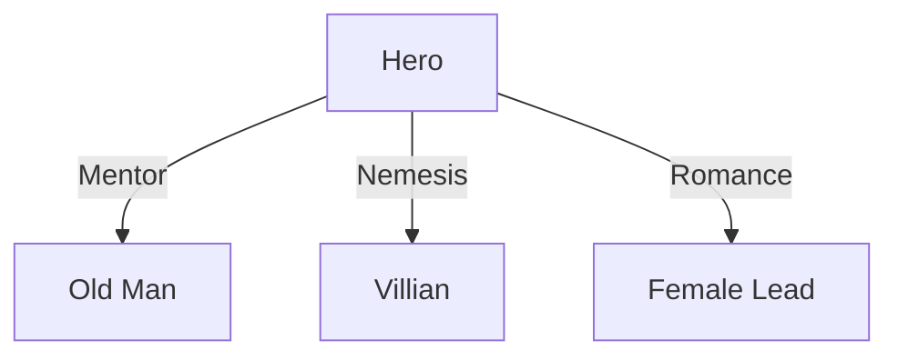

# Novel Writing Assistant

## Skill Overview

**Skill Name**: Novel Writing Assistant  
**Skill Type**: Creative Guidance, Structured Writing  
**Use Case**: Writing web novels, light novels, cultivation stories  
**Core Value**: Lower creative barriers, improve efficiency, ensure quality  

## Trigger Conditions

Automatically triggers when user mentions:
- "write a novel", "create fiction", "story writing"
- "cultivation novel", "fantasy story", "urban fantasy"
- "chapter outline", "character profile", "worldbuilding"
- "help me write", "creative inspiration"

---

## Workflow Overview

This English file is a condensed overview.
For the full 12-step workflow and zh-CN operational details, see `SKILL.md`.

```
Idea → World-building → Characters → Outline → Chapter Plan → Draft
                                                      ↓
Output ← Scoring ← Polish ← Consistency Audit ← Memory System
```

---

## Step 1: Idea Generation

**Goal**: Define novel direction, generate 3 creative options

### User Input Examples

- "Write a cultivation novel"
- "Reborn as a high school student becoming a business tycoon"
- "Trash youth gets a system and crushes everyone"

### Prompt Enhancement

Auto-complete in 8 dimensions:

```
1. Genre        → Main type + Sub type (e.g., Urban + Cultivation)
2. World        → Power system, Social rules, Time setting
3. Protagonist  → Initial identity, Personality, Cheat/System
4. Core conflict → Main plot + First 3 chapters' immediate conflict
5. Satisfaction  → Face-slapping rhythm, Level-up frequency
6. Rhythm      → Small climax every N chapters, Big climax every M chapters
7. Supporting   → Antagonist/Ally/Romance (at least 1 each)
8. Opening hook  → What grabs readers in Chapter 1
```

### Output

1. **3 Book titles** - Catchy with conflict
2. **One-line summary** - Protagonist + Dilemma + Cheat + Goal
3. **Core conflict** - Hero's goal + Biggest obstacle + How to fight
4. **Core satisfaction** - Emotional payoff per chapter

---

## Step 2: World-building

**Goal**: Build complete, consistent world based on selected genre

### Quick Build

```
1. Time setting: [Modern/Ancient/Future/Fantasy]
2. Power system: [Martial arts/Cultivation/Magic/Superpowers/System]
3. Social structure: [Sect/Tribe/Kingdom/City-state]
4. Core rules: [Survival of fittest/Skill above all]
```

### Detailed Build (Optional)

| Element | Content |
|---------|---------|
| Framework | Era, Geography, Social structure |
| Power levels | Detailed ranks, Cultivation methods |
| Faction map | Countries, Sects, Families distribution |
| Taboos | Social rules, Absolute prohibitions |
| Key locations | Main cities, Secret realms, Battlefields |

### Output

- `output/prompt.md` - Complete writing prompt
- `output/faction-map.md` (if needed)

---

## Step 3: Character Design

**Goal**: Create multi-dimensional characters

### Protagonist Template

```
- **Name**: [Auto-generate or user-provided]
- **Initial identity**: [The lower, the better for reversal]
- **Personality**: [Surface trait + Inner trait]
- **Initial dilemma**: [How pathetic is the opening]
- **Cheat/System**: [Abilities and rules]
  - Ability: [Description]
  - Limitation: [Can't spam infinitely]
```

### Supporting Cast

| Type | Requirement |
|------|-------------|
| Antagonist | At least 1, clear conflict with hero |
| Ally | At least 1, clear function |
| Romance | Optional, adds emotional line |

### Output

- `.learnings/CHARACTERS.md` - Character archive

---

## Step 4: Outline Creation

**Goal**: Create complete three-act structure

### Three-Act Structure

| Act | Chapters | Content |
|-----|----------|---------|
| Act 1 | 1-20% | Establish normal → Break normal → Accept mission |
| Act 2 | 20-75% | Trials → Mid-point turn → Darkest moment |
| Act 3 | 75-100% | Final preparation → Climax → Resolution |

### Key Milestones

| Milestone | Position | Content |
|-----------|----------|---------|
| Opening hook | Ch.1 | Must hook readers |
| First climax | Ch.10 | Establish story direction |
| Mid-point turn | Ch.50 | Elevate story scope |
| Darkest moment | Ch.65 | Emotional low point |
| Final climax | Ch.85 | All conflicts erupt |

### Output

- `output/outline.md`

---

## Step 5: Chapter Writing

**Goal**: Generate high-quality chapter text

### Pre-Generation Required Reading

**Must read** `.learnings/` memory files:

```
.learnings/CHARACTERS.md    → All characters' current status
.learnings/LOCATIONS.md     → Appeared locations
.learnings/PLOT_POINTS.md   → Key plot points
.learnings/STORY_BIBLE.md   → World rules
```

### Chapter Template

```markdown
# Chapter XX [Title]

> **Summary**: One-line core event
> **Satisfaction**: Main face-slapping/revelation/reversal
> **Emotional curve**: [Low start high / Building up / Reversal burst]

---

(Body content, 2500-3000 words)

---

> **Chapter hook**: Suspense left for next chapter
```

### Writing Standards

| Element | Requirement |
|---------|-------------|
| Rhythm | At least one satisfaction point per chapter |
| Conflict | Clear conflict drives plot |
| Suspense | Hook at chapter end |
| Consistency | Match previous content |
| Anti-AI | Natural language, no AI artifacts |

### Satisfaction Rhythm Formula

```
Every 1-2 chapters: Small face-slap (crush small fry, small gains)
Every 3-5 chapters: Medium face-slap (defeat stage boss, breakthrough)
Every 8-12 chapters: Big climax (situation reversal, truth revealed)
Every 15-20 chapters: Arc-ending battle
```

---

## Step 6: Consistency Audit

**Goal**: Ensure consistency and quality

### Audit Dimensions

| Dimension | Content |
|-----------|---------|
| Character consistency | Actions/speech match personality |
| Setting consistency | No violation of established rules |
| Logic | Plot/motivation reasonable |
| Foreshadowing | Tracked and resolved |

### Audit Checklist

```
- [ ] Character level/status matches CHARACTERS.md
- [ ] Location descriptions match LOCATIONS.md
- [ ] No violation of STORY_BIBLE.md rules
- [ ] No contradiction with PLOT_POINTS.md
- [ ] Chapter end hook connects to previous chapter
```

### Output

- `.learnings/ERRORS.md` (if issues found)

---

## Step 7: Polish & Anti-AI

**Goal**: Improve text quality, remove AI artifacts

### Anti-AI Three Steps

#### 1. Delete Transition Words

```markdown
# Delete these words
however, but, therefore, then, meanwhile,
notably, actually, in summary, it can be seen
```

#### 2. Break Uniform Rhythm

- Paragraphs no more than 4 lines
- Use short sentences to interrupt long paragraphs
- Use blank lines for rhythm pauses

#### 3. Reduce Explanation, Add Implication

```markdown
# AI style (too full)
Lin Fan was very nervous because he knew the success rate was low.
If he failed, everyone would laugh at him.

# Human style (blank)
Lin Fan gripped the herb, palms sweating.

Fail and get out of the sect.
```

### Quick Checklist

- [ ] Delete all "however", "but", "therefore", "then"
- [ ] Delete all "notably"
- [ ] Paragraphs no more than 4 lines
- [ ] No direct "he felt XX" psychological descriptions
- [ ] Face-slapping scenes no more than 3 paragraphs

---

## Step 8: Quality Scoring

**Goal**: Quantify chapter quality, provide improvement directions

### Scoring Dimensions

| Dimension | Weight | Description |
|-----------|--------|-------------|
| Satisfaction | 25% | Face-slapping/breakthrough/reversal |
| Consistency | 20% | Matches previous content |
| Rhythm | 15% | Setup→Conflict→Climax→Hook |
| Suspense | 15% | Chapter-end hook appeal |
| Dialogue | 10% | Character voice distinction |
| Character | 10% | Reasonable character behavior |
| Anti-AI | 10% | No AI artifacts |

### Grade Scale

| Grade | Score | Action |
|-------|-------|--------|
| S | 9.0+ | Excellent, no changes needed |
| A | 8.0-8.9 | Qualified, publishable |
| B | 7.0-7.9 | Acceptable, minor tweaks |
| C | 6.0-6.9 | Needs revision |
| D | <6.0 | Needs rewrite |

---

## Memory Management System

### Write Timing

| Event | Write to | When |
|-------|----------|------|
| New character appears | `CHARACTERS.md` | Immediately after chapter |
| Character status change | `CHARACTERS.md` | Update entry |
| New location appears | `LOCATIONS.md` | Immediately after chapter |
| Key plot occurs | `PLOT_POINTS.md` | Immediately after chapter |
| Quality issue | `ERRORS.md` | Immediately after issue |

### Read Timing

**Must read all memory files before generating each chapter** to ensure:
- No resurrecting dead characters
- No wrong locations
- No forgotten foreshadowing
- No repeating plot points

---

## Output Structure

```
output/
├── prompt.md              # Complete writing prompt
├── outline.md             # Chapter outline
├── quality-report.md       # Quality scoring tracker
├── chapter-01-title.md    # Chapter files
├── ...
├── character-relations.md # Mermaid diagram
├── faction-map.md
└── level-system.md
```

### Key Plot Diagrams

Use Mermaid syntax:



---

## Reference Documents

| Document | Content |
|----------|---------|
| `references/quality-check.md` | Detailed quality scoring |
| `references/anti-ai-detection.md` | Anti-AI guide |
| `references/prompt-guide.md` | Prompt enhancement guide |
| `references/plot-structures.md` | Plot structure reference |
| `references/examples.md` | Complete examples |
| `assets/PROMPT-TEMPLATE.md` | Prompt template |
| `assets/CHAPTER-TEMPLATE.md` | Chapter template |
| `assets/LEARNINGS-TEMPLATE.md` | Memory file template |

---

## Quick Reference

| Scenario | Action |
|----------|--------|
| User provides direction | Run prompt generation |
| Start writing | Read `.learnings/` first, then write |
| New character | Record to `CHARACTERS.md` |
| New location | Record to `LOCATIONS.md` |
| Key plot | Record to `PLOT_POINTS.md` |
| Quality issue | Record to `ERRORS.md` |
| Output chapter | Write to `output/` |
| Quality check | Use quality scoring |
| Anti-AI | Use anti-AI guide |
