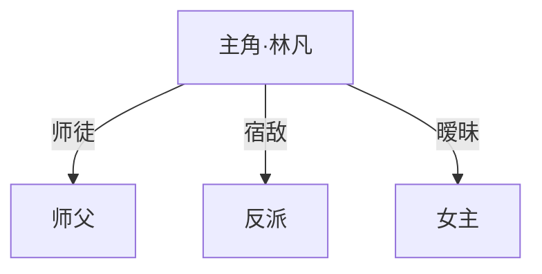

# 小说创作助手

## 技能概述

**技能名称**：小说创作助手  
**技能类型**：创作指导、结构化写作辅助  
**适用场景**：用户需要创作爽文小说、长篇连载、网络小说  
**核心价值**：降低创作门槛，提高写作效率，保证作品质量  
**语言支持**：中文（默认）、English（见 `SKILL.en.md`）

## 触发条件

当用户提到以下关键词时自动触发：
- "写小说"、"长篇小说"、"小说创作"
- "爽文"、"玄幻"、"都市"、"仙侠"、"穿越重生"
- "小说大纲"、"人物设定"、"世界观"
- "帮我写小说"、"创作灵感"

**触发逻辑**：智能识别创作意图，自动匹配创作流程

---

## 创作流程

```
用户方向 → 灵感生成 → 世界观构建 → 人物塑造 → 创作参数配置
                                                                  ↓
           细纲审核 ← 生成细纲 ← 细纲规划 ← 确认细纲 ← 大纲生成 ←←
               ↑                                      ↓
           逻辑检查 ←←←←←←←←←←←←←←←←←←←←←←←←
                     ↑                              ↓
           输出章节 ← 质量检查 ← 润色优化 ← 一致性审核 ← 正文章节
```

---

---

## 第一步：灵感生成

**目标**：确定小说基本方向，生成3套完整创意方案

### 用户输入示例

用户可能只给出一句话：
- "写一个都市修仙的爽文"
- "重生回高中逆袭成商业大亨"
- "废柴少年获得系统后一路碾压"

### 提示词自动完善

按以下8维度自动补全：

```
1. 题材定位    → 主类型 + 子类型（如：都市 + 修仙）
2. 世界观设定  → 力量体系、社会规则、时代背景
3. 主角人设    → 初始身份、性格、金手指/挂
4. 核心冲突    → 主线矛盾 + 前3章的即时冲突
5. 爽点设计    → 打脸节奏、升级频率、装逼方式
6. 节奏规划    → 每N章一个小高潮、每M章一个大高潮
7. 配角框架    → 对手/盟友/红颜各至少1人
8. 开篇钩子    → 第一章用什么抓住读者
```

### 快速问卷（可跳过）

如用户方向模糊，按需收集：

```
1. 题材：[玄幻/都市/仙侠/其他]
2. 核心卖点：[系统流/穿越重生/逆袭打脸/其他]
3. 目标字数：[30万/50万/100万+]
```

### 输出内容

1. **3个备选书名**：直白有冲突，吸引目标读者
2. **一句话简介**：主角+困境+金手指+目标
3. **核心冲突**：主角目标+最大阻碍+对抗方式
4. **核心爽点**：每章能让读者获得的情感满足

---

## 第二步：世界观构建

**目标**：基于选定题材构建完整、自洽的世界观

### 快速构建（用户可直接确认）

```
1. 时代背景：[现代都市/古代仙侠/未来星际/异世界]
2. 力量体系：[武道等级/魔法元素/异能觉醒/系统规则]
3. 社会结构：[宗门统治/家族势力/城邦自治/联邦制]
4. 核心规则：[弱肉强食/实力至上/炼丹师稀缺]
```

### 详细构建（可选）

| 要素 | 内容 |
|------|------|
| 基础框架 | 时代背景、地域分布、社会结构 |
| 力量体系 | 等级详细、修炼方式、突破条件 |
| 势力地图 | 国家、宗门、家族的分布与关系 |
| 禁忌常识 | 社会潜规则、绝对禁忌 |
| 关键场景 | 主要城市、秘境、战场 |

### 输出文件

- `output/提示词.md`：完整创作提示词
- `output/势力地图.md`（如需要）

---

## 第三步：人物塑造

**目标**：创建立体、有深度的角色

### 主角设定

```
- **姓名**: [自动生成或用户提供]
- **初始身份**: [越底层越好，衬托逆袭]
- **性格**: [表面特征 + 内在特征]
- **初始困境**: [开局有多惨]
- **金手指/系统**: [具体能力和规则]
  - 能力：[描述]
  - 限制：[不能无限开挂]
```

### 配角框架

| 类型 | 要求 |
|------|------|
| 对手 | 至少1个，与主角矛盾明确 |
| 盟友 | 至少1个，功能清晰 |
| 红颜 | 可选，增加情感线 |

### 输出文件

- `.learnings/CHARACTERS.md`：角色档案

---

## 第三步半：创作参数配置（交互式）

**目标**：在生成大纲前，让用户确认关键创作参数

### 必问参数

**每次生成大纲前必须使用 `question` 工具询问以下参数**：

#### 参数1：章节数量

```
本书计划多少章？
- 50章（短篇/试水）
- 100章（标准篇幅）
- 200章（长篇连载）
- 500章（超长篇）
- 自定义（输入具体数字）
```

#### 参数2：女角色数量

```
是否添加更多女角色？（1-10个，各有特色）
- 1个（唯一女主）
- 2个（双女主）
- 3个（经典三女主）
- 5个（后宫向）
- 10个（大后宫）
- 自定义（输入具体数字）
```

**女角色特色分配要求**：

| 数量 | 特色组合建议 |
|------|-------------|
| 1 | 女主定位明确（御姐/萝莉/女强） |
| 2 | 性格互补（冷艳+活泼） |
| 3 | 身份各异（校花/总裁/青梅竹马） |
| 5 | 类型分散（御姐/萝莉/女强/病娇/天然呆） |
| 10 | 全类型覆盖，各有独立剧情线 |

#### 参数3：擦边等级

```
是否加入擦边情节？
- 无（纯剧情，无擦边）
- 少量（偶尔暧昧，点到为止）
- 中量（定期安排，有实质互动）
- 大量（频繁出现，尺度较大）
```

**擦边情节分布规划**：

| 等级 | 擦边频率 | 大纲安排 |
|------|---------|---------|
| 无 | 0% | 不安排任何擦边情节 |
| 少量 | 5-10% | 每10-20章安排1次暧昧互动 |
| 中量 | 15-25% | 每4-6章安排1次擦边情节 |
| 大量 | 30-40% | 每2-3章安排1次擦边情节 |

### 参数确认流程

```
步骤1：使用 question 工具一次性询问所有参数
       - 章节数量
       - 女角色数量
       - 擦边等级

步骤2：根据用户选择处理
       - 记录章节数量 → 用于大纲结构规划
       - 记录女角色数量 → 用于人物塑造扩展
       - 记录擦边等级 → 用于细纲情节安排

步骤3：如果选择了擦边等级（非"无"）
       → 询问擦边描写风格（调用 EDGE-TEMPLATE.md）
       → 选项：A含蓄/B直白/C文艺/D暴力美学/E自定义

步骤4：将所有参数写入 output/创作参数.md

步骤5：根据参数调整后续流程
       - 大纲按章节数量规划卷数
       - 人物按女角色数量扩展设定
       - 细纲按擦边等级安排情节
```

### 输出文件

- `output/创作参数.md`：记录所有创作参数配置

---

## 第三步七五：同人作品原著资料（如适用）

**目标**：如果是同人作品，收集原著设定资料，确保创作一致性

### 是否同人判断

**使用 `question` 工具询问**：

```
本次创作是否为同人作品？
- 是，基于现有作品创作
- 否，原创作品
```

**如果选择"否"** → 跳过此步骤，直接进入大纲生成

**如果选择"是"** → 执行以下流程

### 原著资料添加方式

**使用 `question` 工具询问**：

```
请选择添加原著设定资料的方式：
- 本次搜索添加（自动搜索原著信息）
- 自行粘贴添加（手动粘贴原著资料）
```

#### 选项A：本次搜索添加

```
步骤1：询问用户原著作品名称

步骤2：使用 webfetch/websearch 搜索原著信息：
       - 世界观设定（力量体系、社会结构、核心规则）
       - 主要角色（姓名、身份、能力、关系）
       - 重要地点（地名、功能、背景）
       - 关键剧情（主线、名场面、重要转折）
       - 特殊设定（专有名词、术语、规则）

步骤3：整理搜索结果，生成原著设定摘要

步骤4：保存到 .learnings/SOURCE_MATERIAL.md
```

#### 选项B：自行粘贴添加

```
步骤1：提示用户：
       "请粘贴原著设定资料，包括：
        - 世界观设定
        - 主要角色信息
        - 重要地点
        - 关键剧情
        - 其他需要遵循的设定"

步骤2：接收用户粘贴的内容

步骤3：整理格式，保存到 .learnings/SOURCE_MATERIAL.md

步骤4：确认保存成功
```

### 原著资料文件格式

```markdown
# 原著设定资料

## 基本信息
- 原著名称：
- 原著类型：[小说/动漫/影视/游戏]
- 原著状态：[连载中/已完结]

## 世界观设定
### 力量体系
- [列出等级/能力系统]

### 社会结构
- [列出势力/组织]

### 核心规则
- [列出重要规则/设定]

## 主要角色
### 主角
- 姓名：
- 身份：
- 能力：
- 性格：

### 重要配角
- [列出其他重要角色]

## 重要地点
- [列出关键场景]

## 关键剧情
- [列出重要剧情节点]

## 同人创作注意事项
- [需要遵循的设定]
- [可以发挥的空间]
- [禁止改动的元素]
```

### 创作约束

**同人作品必须遵循**：

| 类型 | 约束 |
|------|------|
| 世界观 | 必须符合原著基本设定 |
| 角色 | 原著角色性格不能崩坏 |
| 能力 | 不能超出原著能力体系 |
| 时间线 | 需明确与原著时间线的关系 |
| 名词 | 专有名词必须使用原著术语 |

**可发挥空间**：

| 类型 | 说明 |
|------|------|
| 原创角色 | 可添加新角色 |
| 支线剧情 | 可扩展支线故事 |
| 细节补充 | 可丰富原著未详述的部分 |
| 平行世界 | 可设定为平行世界/重生 |

### 输出文件

- `.learnings/SOURCE_MATERIAL.md`：原著设定资料

### 后续流程关联

```
大纲生成 → 必须引用 SOURCE_MATERIAL.md 确保设定一致
角色塑造 → 原著角色必须符合 SOURCE_MATERIAL.md 描述
细纲规划 → 剧情发展不得违背原著核心设定
正文章节 → 必须使用原著专有名词和术语
```

---

## 第四步：大纲生成

**目标**：制定完整的三幕式小说结构

### 大纲结构

```markdown
# 《小说名》大纲

## 基本信息
- 题材：
- 预计章节数：
- 每章字数：约3000字

## 力量/等级体系
（从低到高列出等级）

## 主线剧情走向
### 第一卷：[卷名]（第1-N章）
- 核心冲突：
- 主角成长：从XX到XX
- 爽点设计：

### 第二卷：[卷名]（第N+1-M章）
...
```

### 三幕式节奏

| 阶段 | 章节占比 | 内容 |
|------|---------|------|
| 第一幕 | 1-20% | 建立常态 → 打破常态 → 接受使命 |
| 第二幕 | 20-75% | 试炼成长 → 中点转折 → 至暗时刻 |
| 第三幕 | 75-100% | 最终准备 → 高潮对决 → 结局余韵 |

### 关键节点

> 注意：以下章节号均以100章为基准，实际应按创作参数中的总章节数等比缩放（公式：实际章号 = 指定章节比例 × 总章节数）。

| 节点 | 比例（100章示例） | 内容 |
|------|------|---------|
| 开篇钩子 | 1（第1章） | 必须吸引读者 |
| 第一个高潮 | 10%（第10章） | 确立故事方向 |
| 中点转折 | 50%（第50章） | 提升故事格局 |
| 至暗时刻 | 65%（第65章） | 情感最低点 |
| 最终高潮 | 85%（第85章） | 所有矛盾爆发 |

### 输出文件

- `output/大纲.md`

---

## 第四步半：细纲规划

**目标**：规划全本细纲的生成策略

### 规划内容

```
1. 确定每卷章数
2. 分配每章的核心功能（铺垫/推进/高潮/转折）
3. 规划伏笔埋设位置
4. 规划爽点分布
5. 标记需要重点审核的章节
```

### 细纲规划模板

```markdown
## 每卷章数分配

| 卷 | 章节范围 | 核心功能 | 预计高潮数 |
|----|---------|---------|-----------|
| 第一卷 | 1-10 | 建世界观+主角成长 | 2 |
| 第二卷 | 11-20 | 势力冲突+第一个大高潮 | 3 |
| ... | ... | ... | ... |

## 伏笔规划

| 伏笔类型 | 埋设章节 | 回收章节 | 重要性 |
|---------|---------|---------|--------|
| 主线伏笔A | 1 | 50 | 高 |
| 支线伏笔B | 5 | 20 | 中 |
```

---

## 第五步：生成细纲

**目标**：生成每章的详细细纲

### 细纲内容

每章细纲包含：

| 项目 | 内容 |
|------|------|
| 章节类型 | 剧情推进/战斗/情感/转折/过渡 |
| 核心事件 | 本章发生的最重要的一件事 |
| 爽点设计 | 本章的爽点类型和位置 |
| 情节点 | 3-5个关键情节点 |
| 人物变化 | 出场人物、状态变化 |
| 地点转移 | 涉及地点、是否有地点变化 |
| 伏笔 | 本章埋设/回收的伏笔 |
| 章末钩子 | 留给下一章的悬念 |

### 细纲模板

```markdown
## 第XX章 [章节名]

### 基本信息
- **章节类型**：剧情推进
- **核心事件**：[一句话描述]
- **爽点类型**：打脸/突破/逆转
- **情绪曲线**：低开高走

### 剧情要素
- **开场**：[如何开始]
- **发展**：[3-5个情节点]
- **高潮**：[本章最大爽点]
- **收束**：[如何结束]

### 人物动态
- **出场**：[角色列表]
- **变化**：[角色A：状态变化]

### 伏笔
- **埋设**：[伏笔列表]
- **回收**：[伏笔列表]
```

### 输出文件

- `output/细纲.md`（所有章节细纲汇总）

**详见** `references/chapter-outline.md`

---

## 第六步：逻辑审核

**目标**：检查细纲中的逻辑矛盾

### 审核维度

| 维度 | 检查项 |
|------|--------|
| 时间线 | 章节衔接、时间跳跃合理 |
| 空间线 | 地点转移、距离合理 |
| 人物线 | 存活状态、等级匹配、关系变化 |
| 设定线 | 力量体系、社会规则、物品来源 |
| 伏笔线 | 伏笔呼应、回收时机、逻辑自洽 |

### 审核流程

```
1. 逐章检查细纲
2. 跨章节检查连贯性
3. 标记问题章节
4. 修改问题细纲
5. 再次审核直到通过
6. 用户确认细纲
```

### 审核检查表

```markdown
### 必检项
- [ ] 时间线一致（上章→本章→下章）
- [ ] 空间线一致（地点转移合理）
- [ ] 人物存活（无已死角色出场）
- [ ] 等级匹配（战力无崩坏）
- [ ] 能力来源（能力有明确来源）
- [ ] 伏笔自洽（伏笔逻辑不矛盾）

### 跨章节检查
- [ ] 与前3章无矛盾
- [ ] 与大纲设定无冲突
```

### 输出文件

- `output/逻辑审核报告.md`

### 审核通过条件

- 无严重逻辑矛盾
- 无人物状态矛盾
- 无设定违背
- 伏笔逻辑自洽

**详见** `references/chapter-outline.md`

---

## 第七步：正文章节生成

**目标**：基于审核通过的细纲生成正文

### 生成前必读

#### 1. 文风选择（交互式）

**每次生成正文前必须询问用户文风选择**，使用 `question` 工具发起交互：

```
询问内容：
"请选择本次写作的文风："
```

**选项列表**：

| 选项 | 文风 | 适用场景 |
|------|------|---------|
| A | 热血爽文风 | 节奏快、爽点密集、打脸碾压 |
| B | 都市现实风 | 贴近现实、对话自然、有烟火气 |
| C | 古风仙侠风 | 文字有古韵、仙气飘飘、意境深远 |
| D | 悬疑惊悚风 | 氛围压抑、悬念迭起、反转出人意料 |
| E | 轻松日常风 | 轻松幽默、日常有趣、没有压力 |
| 上次 | 继续使用上次的文风 | 读取 STYLE-TEMPLATE.md 中已激活的配置 |
| 自定义 | 粘贴自定义文风提示词 | 用户提供完整的文风要求 |

**交互流程**：

```
步骤1：使用 question 工具询问用户文风选择
       选项：A热血 / B都市 / C仙侠 / D悬疑 / E日常 / 上次 / 自定义

步骤2：根据用户选择处理
       - 选择 A-E：将对应文风写入 STYLE-TEMPLATE.md（激活该配置）
       - 选择"上次"：读取 STYLE-TEMPLATE.md 中已激活的配置
       - 选择"自定义"：提示用户粘贴文风提示词，写入 STYLE-TEMPLATE.md

步骤3：读取 STYLE-TEMPLATE.md 确认文风已激活

步骤4：将文风要求作为写作约束，正文必须严格按照文风要求执行
```

**自定义文风处理**：

当用户选择"自定义"时：
```
1. 提示用户："请粘贴你的文风提示词，包含核心特点、句式要求、禁止事项等"
2. 将用户提供的内容写入 STYLE-TEMPLATE.md 的"自定义文风"区域
3. 激活自定义文风配置
4. 确认写入成功
```

**文风优先级**：

| 优先级 | 来源 | 说明 |
|--------|------|------|
| 1（最高） | 用户本次选择 | 本次交互选择的文风 |
| 2 | STYLE-TEMPLATE.md | 已保存的文风配置 |
| 3 | 去AI味规则 | anti-ai-detection.md 中的基础规则 |
| 4 | 爽文节奏公式 | 通用爽文写作规律 |

#### 2. 载入记忆文件

**必须读取** `.learnings/` 中的记忆文件：

```
.learnings/CHARACTERS.md    → 当前所有角色的状态
.learnings/LOCATIONS.md     → 已出现的地点
.learnings/PLOT_POINTS.md   → 已发生的关键情节
.learnings/STORY_BIBLE.md   → 世界观设定和规则
```

#### 3. 载入擦边规范（如适用）

**检查 `output/创作参数.md` 中的擦边等级设置**：

```
如果擦边等级 = "无" → 跳过此步骤
如果擦边等级 ≠ "无" → 执行以下流程
```

**擦边规范载入流程**：

```
步骤1：读取 output/创作参数.md，确认擦边等级

步骤2：读取 assets/EDGE-TEMPLATE.md 擦边描写规范

步骤3：确认当前激活的擦边风格（取消注释的风格配置）

步骤4：将擦边要求作为写作约束
       - 正文中的擦边情节必须严格按照风格要求执行
       - 擦边频率需符合创作参数中的等级设置
```

**擦边风格选择（如未选择或需要切换）**：

使用 `question` 工具询问：

```
请选择擦边描写风格：
- A 含蓄暗示型（点到为止，留白想象）
- B 直白热烈型（直接描写，不绕弯子）
- C 文艺唯美型（诗意语言，升华情感）
- D 暴力美学型（情欲与危险交织）
- E 纯情青涩型（青春感，纯真感）
- 上次 继续使用上次的风格
- 自定义 粘贴自定义擦边规范
```

**擦边描写优先级**：

| 优先级 | 来源 | 说明 |
|--------|------|------|
| 1（最高） | 用户本次选择 | 本次交互选择的风格 |
| 2 | EDGE-TEMPLATE.md | 已保存的风格配置 |
| 3 | 创作参数 | 擦边等级决定频率 |
| 4 | 平台规范 | 确保内容安全 |

**擦边情节检查清单**（写正文时必须对照）：

```
- [ ] 本章是否有擦边情节安排（参考细纲）
- [ ] 擦边风格是否符合 EDGE-TEMPLATE.md 配置
- [ ] 描写尺度是否在允许范围内
- [ ] 禁止内容是否全部避免
- [ ] 擦边情节是否服务于剧情（非无意义插入）
```

### 章节模板

```markdown
# 第XX章 [章节名]

> **本章概要**：一句话概括本章核心事件
> **本章爽点**：本章的主要爽感来源
> **情绪曲线**：[低开高走 / 层层递进 / 反转爆发]

---

（正文内容，3000-3500字）

---

> **章末钩子**：留下的悬念，引导继续阅读
```

### 写作质量标准

| 要素 | 要求 |
|------|------|
| 节奏 | 每章至少一个小爽点 |
| 冲突 | 每章有明确的矛盾推动 |
| 悬念 | 章末必须设置钩子 |
| 连贯性 | 与前文保持一致 |
| 去AI味 | 语言自然流畅，无AI痕迹 |

### 爽文节奏公式

```
每 1-2 章：小打脸（碾压小角色、获得小收获）
每 3-5 章：中打脸（击败阶段性对手、突破等级）
每 8-12 章：大高潮（翻转局势、揭示真相）
每 15-20 章：卷终决战
```

---

## 第八步：一致性审核

**目标**：确保已写内容的一致性、合理性

### 审核维度

| 维度 | 内容 |
|------|------|
| 人设一致性 | 行为/语言是否符合人物性格 |
| 设定一致性 | 是否违背已建立的世界规则 |
| 逻辑合理性 | 情节/动机是否合理 |
| 伏笔回收 | 已埋伏笔是否被追踪和回收 |

### 审核检查表

```
- [ ] 角色等级/状态与 CHARACTERS.md 一致
- [ ] 地点描写与 LOCATIONS.md 一致
- [ ] 未违背 STORY_BIBLE.md 中的设定
- [ ] 未与 PLOT_POINTS.md 中已有情节矛盾
- [ ] 章末钩子是否承接上章
```

### 输出文件

- `.learnings/ERRORS.md`（如有问题）

---

## 第九步：润色优化（绝对零度写作）

**目标**：按照"绝对零度写作"原则提升文字质量

### 核心原则

1. **直接呈现** - 只写可从第三方观测的事实，不写内心活动
2. **禁止修辞** - 无条件禁止比喻、隐喻、类比、拟人
3. **精确细节** - 重要细节精确到厘米/秒级

### 例外说明

**如果当前激活的擦边风格为「风格 C 文艺唯美型」**，该风格要求使用自然意象比喻，此时允许在擦边情节中使用比喻词（以美化情感为目的）。其他情况禁用比喻。

### 必禁清单

#### 1. 比喻词（非风格 C 擦边情节时零容忍）

```
像、就像、好像、如同、仿佛、宛如、犹如、好似
```

#### 2. 直白心理描写

```markdown
# 禁止
他很紧张、她很焦急、他感到愤怒

# 正确（通过微动作展示）
他手心全是汗。她眼眶撑开了些。他没出声。
```

#### 3. 禁语表高频词

```
冷笑、冷哼、颤抖、泛白、勾起弧度、空气凝固、
沉默了很久、指节泛白、四肢百骸
```

#### 4. 欧化表达

```markdown
# 禁止
他很高、她很美、作出决定、被激怒

# 正确
他身材高大、她容貌出众、决定、他火了
```

### 快速检查表

- [ ] 无比喻词（像/如同/仿佛/宛如……）
- [ ] 无直白心理描写（他很XX/她感到XX）
- [ ] 无禁语表词汇
- [ ] 无"被"字结构滥用
- [ ] 段落不超过4行
- [ ] 无"他动了"/"就是现在"

**详见** `references/anti-ai-detection.md`

---

## 第十步：质量评分

**目标**：量化章节质量，提供可改进方向

### 评分维度

| 维度 | 权重 | 说明 |
|------|------|------|
| 爽点设置 | 25% | 打脸/突破/逆转等爽感设计 |
| 情节连贯性 | 20% | 与前文设定一致 |
| 节奏把控 | 15% | 铺垫→冲突→高潮→钩子 |
| 悬念钩子 | 15% | 章末悬念吸引力 |
| 对话质量 | 10% | 角色对话个性化 |
| 角色塑造 | 10% | 人物行为合理 |
| 去AI味 | 10% | 无AI生成痕迹 |

### 评分等级

| 等级 | 分数 | 处理 |
|------|------|------|
| S | 9.0+ | 精品，无需修改 |
| A | 8.0-8.9 | 合格，可发布 |
| B | 7.0-7.9 | 可接受，微调后发布 |
| C | 6.0-6.9 | 需修改重点段落 |
| D | <6.0 | 需重写该章 |

### 触发条件

| 条件 | 处理 |
|------|------|
| 评分 < 6.0 | 必须重写 |
| 连续 2 章 < 7.0 | 暂停，检查问题根源 |
| 去AI味 < 5.0 | 必须进行去AI味修改 |

---

## 记忆管理系统（真相档案）

为了保持创作一致性，系统为每本书维护 7 个核心文件（真相档案）：

| 文件名 | 用途 | 包含内容 |
|--------|------|----------|
| `STORY_BIBLE.md` | **世界状态** | 地图、地点、科技水平、力量系统、世界观规则补充 |
| `CHARACTERS.md` | **角色矩阵** | 姓名、关系、人物弧光、动机、状态变化（升级/受伤/死亡） |
| `RESOURCES.md` | **资源账本** | 游戏内物品、金钱、能量等级 |
| `PLOT_POINTS.md` | **章节概要** | 事件发展、关键情节、伏笔 |
| `SUBPLOTS.md` | **子剧情板** | 活跃和休眠的子剧情，钩子 |
| `EMOTIONS.md` | **情感弧线** | 角色情感发展轨迹 |
| `SUSPENSE.md` | **悬念池** | 未解的谜团、对读者的承诺、待回收伏笔 |
| `output/CHAPTERS.md` | **章节索引** | 所有章节状态、字数、爽点、伏笔追踪、角色出场统计 |

### 写入时机

| 事件 | 记录到 | 时机 |
|------|--------|------|
| 新角色出场 | `CHARACTERS.md` | 该章生成完毕后立即写入 |
| 角色状态变化 | `CHARACTERS.md` | 涉及升级、受伤、死亡时，立即更新对应角色条目 |
| 新地点出现 | `LOCATIONS.md` / `STORY_BIBLE.md` | 该章生成完毕后立即写入 |
| 关键情节发生 | `PLOT_POINTS.md` | 该章生成完毕后立即写入 |
| 世界观规则补充 | `STORY_BIBLE.md` | 发现新设定时立即写入 |
| 生成失败或质量差 | `ERRORS.md` | 失败后立即记录原因 |
| 章节生成完毕 | `output/CHAPTERS.md` | 每章生成后立即追加索引行 |
| 会话结束 | `SESSION.md` | Stop 钩子自动更新时间戳 |

### 读取时机

**每次生成新章节前必须读取**以上所有记忆文件，确保：
- **生存检查**：不让已死角色复活。
- **地理检查**：确保方位一致（如：不会把“东城”写成“西城”）。
- **伏笔检查**：不遗忘上一章埋的伏笔。
- **去重检查**：不重复已有的情节桥段。
---

## 输出规范

### 文件结构

```
output/
├── CHAPTERS.md           # 章节索引（自动维护）
├── 创作参数.md           # 创作参数配置（章节数/女角色/擦边等级）
├── 提示词.md           # 完善后的创作提示词
├── 大纲.md             # 全局章节大纲
├── 细纲.md             # 所有章节细纲汇总
├── 逻辑审核报告.md     # 细纲逻辑审核结果
├── 质量报告.md          # 章节质量评分追踪
├── 第01章_[章名].md    # 各章节独立文件
├── ...
├── 人物关系图.md        # Mermaid格式图解
├── 势力分布图.md
└── 等级体系图.md
```

### 关键情节图解

使用 Mermaid 语法：



---

## 记忆系统协作

本技能的 `.learnings/` 系统参考了 `self-improving-agent` 的设计理念：

| self-improving-agent | 小说创作助手 |
|---------------------|-------------|
| 记录代码错误 | 记录剧情穿帮 |
| 记录知识空白 | 记录设定矛盾 |
| 提升到 CLAUDE.md | 沉淀到 STORY_BIBLE.md |
| 提取为技能 | 提炼为创作模式 |

核心思想：**捕获 → 记录 → 沉淀 → 复用**

### 跨 Session 恢复

- **`SESSION.md`**：记录当前创作进度，每次会话结束时更新。下次打开时读取即可知道从哪里继续。
- **`output/CHAPTERS.md`**：章节索引，追踪所有章节的生成状态、字数、爽点、伏笔、角色出场。

### 分层管理（防止文件膨胀）

长篇创作（200-500章）中，`.learnings/` 文件会自然分层：

| 层级 | 定义 | 何时必读 |
|------|------|---------|
| **活跃** | 近10-20章内出场/发生 | 每次生成前必读 |
| **休眠** | 10-30章未出场/未推进 | 涉及相关角色/情节时查阅 |
| **归档** | 30+章前或已死亡/已回收 | 需要追溯时查阅 |

### 上下文分层检索策略

写到第N章时，上下文加载策略：

| 内容 | 加载范围 | 原因 |
|------|---------|------|
| 正文 | 最近3章全文 | 确保直接连贯性 |
| 细纲 | 当前章 + 下3章 | 规划写作 |
| CHARACTERS.md | 活跃角色全读 + 休眠/归档只看头部摘要 | 防止角色膨胀 |
| PLOT_POINTS.md | 近20章情节 | 确保情节连贯 |
| SUSPENSE.md | 全部活跃悬念 | 防止遗忘伏笔 |
| STORY_BIBLE.md | 全文 | 世界观规则不可变 |

---

## 快速参考表

| 场景 | 操作 |
|------|------|
| 开始创作 | 用户选择题材 → 进入灵感生成 |
| 选择题材方向 | 19种预设题材 + 自定义 |
| 用户提供方向 | 执行提示词生成流程 |
| 配置创作参数 | 系统询问：章节数量/女角色数量/擦边等级 |
| 选择章节数量 | 50章/100章/200章/500章/自定义 |
| 设置女角色数量 | 1-10个，各有特色 |
| 设置擦边等级 | 无/少量/中量/大量 |
| 选择擦边风格 | A含蓄/B直白/C文艺/D暴力/E纯情/上次/自定义 |
| 自定义擦边风格 | 选择"自定义"，粘贴你的擦边描写规范 |
| 写正文前选文风 | 系统自动询问：A热血/B都市/C仙侠/D悬疑/E日常/上次/自定义 |
| 使用预设文风 | 选择对应选项，系统自动激活配置 |
| 自定义文风 | 选择"自定义"，粘贴你的文风提示词 |
| 使用上次文风 | 选择"上次"，系统读取已保存的配置 |
| 引入新角色 | 记录到 `CHARACTERS.md` |
| 出现新地点 | 记录到 `LOCATIONS.md` |
| 关键情节 | 记录到 `PLOT_POINTS.md` |
| 生成质量问题 | 记录到 `ERRORS.md` |
| 输出章节 | 按模板生成到 `output/` |
| 质量检查 | 使用质量评分系统 |
| 去AI味 | 使用去AI味指南 |

---

## 参考文档

| 文档 | 内容 |
|------|------|
| `references/chapter-outline.md` | 章节细纲生成与逻辑审核 |
| `references/quality-check.md` | 详细质量评分标准 |
| `references/anti-ai-detection.md` | 去AI味指南 |
| `references/prompt-guide.md` | 提示词完善指南 |
| `references/plot-structures.md` | 情节结构参考 |
| `references/examples.md` | 完整示例集 |
| `assets/PROMPT-TEMPLATE.md` | 提示词模板 |
| `assets/CHAPTER-TEMPLATE.md` | 章节模板 |
| `assets/LEARNINGS-TEMPLATE.md` | 记忆文件模板 |
| `assets/STYLE-TEMPLATE.md` | 文风提示词配置（5种预设+自定义） |
| `assets/EDGE-TEMPLATE.md` | 擦边描写规范（5种风格+自定义） |
